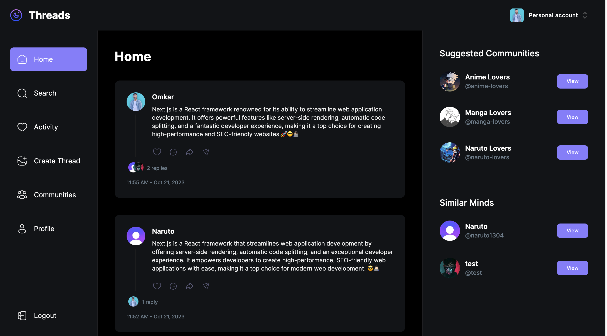
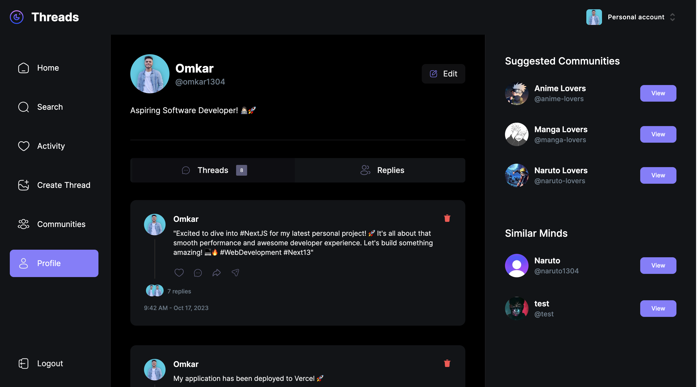

# Threads-using-NextJS

Threads is a comprehensive full-stack web application, leveraging the cutting-edge Next.js technology for server-side rendering with TypeScript, and harnessing the power of React for crafting reusable components. The application boasts a visually stunning layout, meticulously designed with Tailwind CSS. User authentication is seamlessly managed through Clerk, enabling login via popular social accounts and empowering users to create their own organizations. The application relies on the strength of Shadcn components and the robust validation capabilities of Zod. Handling file uploads is made effortless with UploadThing, while real-time event management is achieved through webhooks. The backend infrastructure is robustly supported by MongoDB. Threads combines the latest in web development technologies to deliver a top-tier user experience and functionality.

## Live Project Link

The project is hosted on Vercel and can be accessed using the following link - https://threads-connect.vercel.app

## Features

- Next.js 13.4 with Server Side Rendering
- MongoDB handling of complex schemas, multiple data population
- Beautiful layouts with TailwindCSS
- Clerk for authentication and create organizations
- Handle file uploads with UploadThing
- Shadcn components
- Listen to real-time events with webhooks
- Validate data with Zod
- Manage forms with react hook form

## Technologies Used

The following technologies were used in the development of this project:

- NextJS - React framework that enables several extra features, including server-side rendering and generating static websites
- ReactJS - A JavaScript library for building user interfaces
- MongoDB - Open source NoSQL database to handle coomplex schemas, multiple data population
- Clerk - To handle authentication and create organizations
- Shadcn UI - Focuses on accessibility and includes components such as buttons, menus, dialogs, tooltips, and more
- UploadThing - It is a file-uploading service designed for Next.js developers
- Tailwind CSS - Open source CSS framework

## Conclusion

Threads is a cutting-edge full-stack web app built on Next.js and React, with a stunning Tailwind CSS layout. It features seamless user authentication via Clerk, dynamic validation with Shadcn and Zod, and supports real-time events with webhooks. With MongoDB as the backend, Threads is a powerful and elegant solution for modern web development.